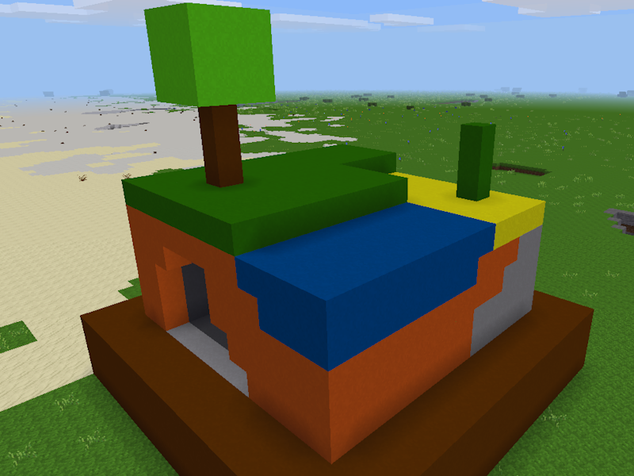
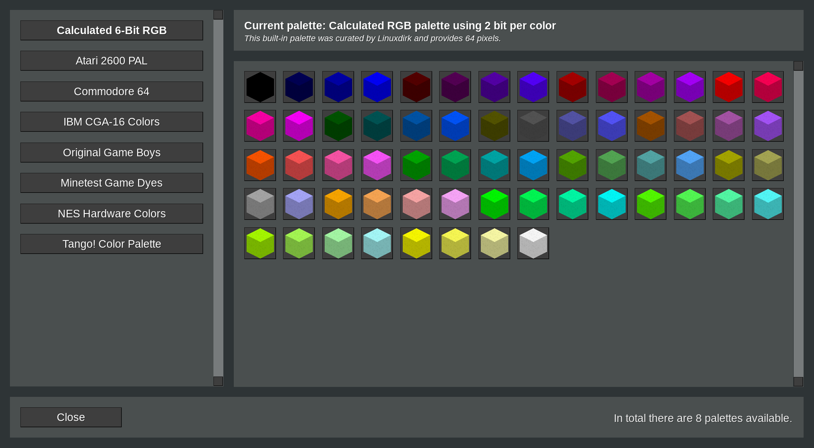
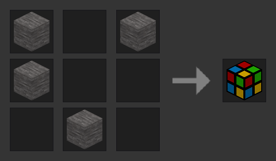

**_Pixelart_ is a game-agnostic mod that adds colored nodes grouped in palettes to Luanti**



The nodes can be used for all sorts of creative building activities and are mainly meant for creating pixelart (or voxelart) on servers or in singleplayer worlds with a focus on creative building.

## Using the mod

The mod can be used as-is. Just install and enable it. The features of the mod do not depend on any specific game or other mods.

There are two options to access the palettes with the “pixel nodes”: A chat command and an access node. Just enter `/pixelart` or craft the access node and rightlick it.



From the selector you chose a palette you like and then click on the individual pixel nodes of that palette to transfer them into your inventory (granted there is enough space in your inventory). Then simply place the pixels in the world as you like.

The nodes are not removed from your inventory when placing them. Pixeling is free!

The crafting recipe for the selector access node is always the same and automatically uses whatever material your game uses as “mapgen stone” (which is basically what the world is made of underground).



You can also uncraft the selector access node back into 4 “mapgen stone” items.

## Built-in palettes

The built-in palettes are curated by the mod author.

| ID               | Name                 | Description                                        |
|------------------|----------------------|----------------------------------------------------|
| `6_bit_rgb`      | Calculated 6-Bit RGB | Calculated RGB palette using 2 bit per color       |
| `atari_2600_pal` | Atari 2600 PAL       | Palette used by the Atari 2600 (PAL version)       |
| `c64`            | Commodore 64         | 8-bit hardware colors of the C64’s VIC-II chip     |
| `cga`            | IBM CGA-16 Colors    | Representation of the CGA 4-bit RGBI colors        |
| `gameboy`        | Original Game Boys   | Simulated colors of the original 4-shade Game Boys |
| `minetest`       | Minetest Game Dyes   | Median colors from the the MTG default dyes        |
| `nes`            | NES Hardware Colors  | Cleaned up Hardware colors of the NES PPU          |
| `tango`          | Tango! Color Palette | Color palette from the *Free Desktop Project*      |

Feel free to suggest some more!

## Create custom palettes and override built-in ones

When placing palette files in `./worlds/worlddirectory/_pixelart/palettes/`, those files are loaded after the built-in palettes. The files are simple Lua files (`filename.lua`, `filename` is used as ID) that return a table.

If you use the same name as one of the built-in palettes, the world-specific palette takes precedence over the built-in one. That means, that you can override the palette IDs with your custom ones.

```lua
return {
    name = 'My Cool Palette',
    curator = 'Some Nice Person',
    description = 'A short palette description',
    pixels = {
        PixelSpec1,
        PixelSpec2,
        PixelspecN
    }
}
```

Since this is a regular Lua file, you can run other Lua code before returning the table. Just be reasonable, okay? :) Since those files are executed without any further validation, you or someone else could break the palette, the mod, or the server/world. Make sure to validate the file actually being a correct palette definition before using it.

* The `name` attribute defines the name/title of the palette. It should not be too long, because it needs to fit on a 4.5 formspec units wide button. This field is optional. If not used, a generated title containing the ID is shown instead.
* By providing `curator` you can mention who curated the palette. If omitted, nothing is shown instead. It is always nice to show people who did something. So while this is optional, palette providers are encouraged to set the curator value (it can be the name, nickname, online handle, whatever you like).
* With `description` you can add a description to the palette. This description is shown in the palette selector dialog. It should describe the palette in a short and precise way. If omitted, the palette name is used.
* In the `pixels` table, all PixelSpecs for the individually colored pixel nodes are defined. If the table is empty, the palette gets removed from the list of registered palettes. See below how a PixelSpec is defined.

You cannot replace individual configuration from existing palettes, only replace/remove them as a whole. See “World-specific settings” on how to disable loading of the built-in palettes completely.

### PixelSpec definition

The `pixels` entry is a table containing all PixelSpecs for the palette. A PixelSpec is either a hexadecimal value prefixed with `#` for a color, one of the two control characters, or a table defining the pixel in more detail.

There is a maximum of 128 possible color PixelSpecs per palette. Keep in mind that for each color definition one node will be registered. A 128 colors palette alone registers 128 nodes. Control character PixelSpecs do not count towards this limit.

This is the simplest PixelSpec just defining the color or one of the formatting options. If providing a color, the name of the node is automatically generated using the color value.

```lua
'#729fcf' -- A pixel with the name “Pixel #729fcf” (or translated)
'n'       -- Wrap the palette buttons in the selector dialog to a new line
's'       -- Add an empty space in the current line in the selector dialog
```

This definition is a full PixelSpec setting color and name. The generated pixel node then uses the `name`. Names are used as-is and cannot be translated without further manual coding.

```lua
{
    color = '#729fcf',     -- Mandatory color definition
    name = 'My Cool Name', -- Optional name for the created pixel (node)
}
```

The node IDs are generated from a combination of the palette ID and the color. For example: `pixelart:my_cool_palette_729fcf`. This means, you can only register a color once per palette.

Multiple definitions of the same color show up in the selector dialog but are using the same name (last PixelSpec in the palette) and of course give you the same node. Curators should check for PixelSpecs with same colors before releasing a palette.

### Example palette code

```lua
return {
    name = 'My Cool Palette',
    curator = 'Some Nice Person',
    description = 'Short discription of that palette',
    pixels = {
        '#000001',
        { color = '#729fcf', name = 'My Cool Pixel Node' },
        '#000003',
        'n', -- A new line
        -- more colors here
        '#000128'
    }
}
```

As described: By default there is a limit of 128 nodes per world-specific palette, see below for configuration and how to change that limit.

## Configuration

This mod can be configured on a per-world basis. The world-specific settings are stored in `./worlds/worlddirectory/_pixelart/pixelart_settings.ini` (or `pixelart_settings.conf` if you prefer – if both are present, the `.ini` file takes precedence) and are in the same format as the default `minetest.conf` configuration file.

If the file does not exist, the default values of the mod are used. And settings that are not present in the existing file are automatically defined with their default values, too.

```ini
# Register an access node
#
# The pixelart selector formspec can be opened with a chat command. In
# addition to that, a node will be registered, allowing players to craft
# an interface to that.
#
# If this option is `false`, players can only access the dialog using the
# provided chat command.
pixelart_access_node = true

# Provide a chat command
#
# For opening the pixelart selector dialog formspec, a simple chat command
# `/pixelart` can be used. This opens the ready-to-use dialog.
#
# Please note: when disabling both the access node and the chat command,
# players have no access to the palettes selection and pixel nodes.
pixelart_chat_command = true

# Define the digging speed
#
# When set to `true`, the digging speed for the pixel nodes is raised from
# 0.5 seconds (like when digging sign-like or rails-like node) to immediately
# (like the speed of digging Minetest Game default torches).
#
# It could be harder for mobile players to precisely dig the pixel nodes
# with this setting enabled. Hold-to-dig would also be faster and could
# lead to accidentally removing nodes the players did not want to remove.
pixelart_fast_digging = false

# Hide nodes from creative inventory
#
# By default, all registered pixel nodes are hidden from the creative
# inventory (granted, that the used game supports that in the intended
# way by respecting the `not_in_creative_inventory` group).
#
# When disabling the access node and chat command, this should be set to
# `false` so players have access to the individual pixel nodes from the
# creative mode inventory.
pixelart_hide_nodes = true

# Load built-in palettes
#
# The mod comes with a variety of palettes from author’s choice. If you want
# to provide your custom palettes only, you need to set this to false. When
# set to false, none of the built-in palettes are loaded.
#
# All nodes from those palettes that are already placed in the world or are
# in the player’s inventories will become invalid nodes.
pixelart_load_builtin = true

# Maximum amount of pixels per world-specific palette
#
# With this value you can control the amount of supported pixels per custom
# palette in a world. Don’t forget that for each PixelSpec in the palette
# one node will be registered. This could fill up the maximum amount of nodes
# supported by Luanti real quick.
#
# If there are more PixelSpecs defined in a palette, the node registration
# stops at this amount of registered nodes. The built-in palettes are not
# affected by this setting.
pixelart_max_pixels = 128

# Control pixel node’s noise color effect
#
# The registered nodes come with a noise effect to break up the uniformity
# of the node tile colors. If you want uniform colors, set to 0 to disable
# this effect or to 255 or larger to use the full noise effect.
#
# This equally affects all pixel node’s tiles from all palettes.
pixelart_noise_opacity = 32

# User privileges in order to access the mod functionality
#
# You can define needed user privileges in order to limit access to the mod
# functionality. The configuration is simply a list of privilege names, either
# comma-separated or not. The standard `interact` privilege is probably the
# most reasonable one.
#
# See the mod’s documentation on the intended use of this setting.
pixelart_privileges = interact
```

The code above shows the default values.

### Intended use for the privileges setting

By default, the `pixelart_privileges` setting is set to `interact`, meaning that players can use the mod’s features as soon as they get the `interact` privilege granted. Just the `interact` privilege alone is redundant, because with `interact` the player can, well, interact with the world and use the chat command.

Administrators can set additional privileges here, for example: by using a “companion mod”, server administrators can register a `can_create_pixelart` privilege and granting this privilege to pixel artists only and define it as needed privilege in the configuration. So normal players with `interact` can interact with the world, but only those *pixel artist players* can interact with the mod’s features.

The mod checks if players have the needed privileges. If a privilege is missing, players get an error message when they try to interact with the mod’s features, which means: the chat command `/pixelart`, placing or digging any pixel nodes or the selector access node, trying to access the selector formspec using an already placed selector access node, or somehow sending formspec fields in the mod’s name to the server.

## (Potential) Issues

Since the mod is fully game agnostic, some issues could appear.

* The selector dialog is unreadable due to the game setting colors and/or fonts that are not compatible with the selector dialog’s formspec definition.
* The selector dialog access node is uncraftable because the `mapgen_stone` alias refers to a node that is not obtainable or the recipe is already used for something else.
* Rightclicking the selector dialog access node does nothing because the game intercepts rightlicking nodes
* Not all game nodes or palette nodes are registered because the hard limit of available internal Luanti node IDs is used up because the game wants to register a lot of nodes or there are a lot of large palettes.

In case of this or any other issues feel free to drop me a node in the CDB or the forums!

## Translations

Missing your language? Feel free to add it!

[](https://translate.codeberg.org/projects/linuxdirks-luanti-mods/pixelart)

